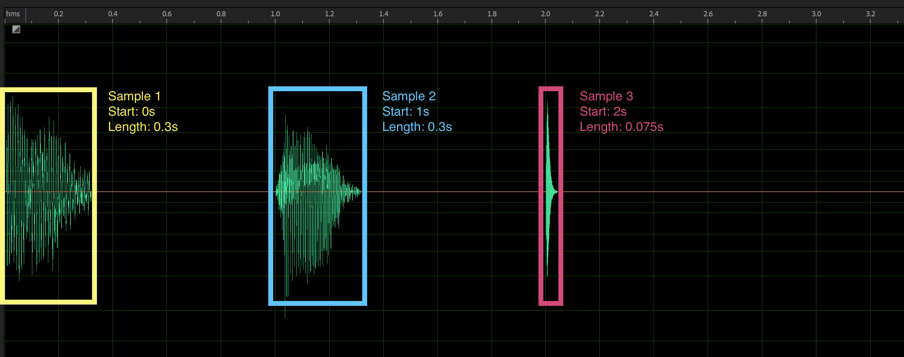

# useSound

### A React Hook for Sound Effects

The web needs more (tasteful) sounds!

- 👂 Lets your website communicate using 2 human senses instead of 1
- 🔥 Declarative Hooks API
- ⚡️ <1kb bytes (gzip) in your bundle! ~10kb loaded async.
- ✨ Built with Typescript
- 🗣 Uses a powerful, battle-tested audio utility: [**Howler.js**](https://howlerjs.com/)

[](https://bundlephobia.com/result?p=use-sound) [](https://opensource.org/licenses/MIT) [](https://www.npmjs.com/package/use-sound) [](https://github.com/joshwcomeau/use-sound/blob/master/CONDUCT.md)

This library only works with React DOM, but @remigallego created an alternative for React Native! Check out [react-native-use-sound](https://github.com/remigallego/react-native-use-sound).

---

## Status

This project is “semi-maintained” 😅

I don't have the bandwidth right now to look into edge-case issues or help troubleshoot, but I plan on keeping it up-to-date with major React releases, and fixing issues that are both serious and common.

If you have ideas for features, or run into strange quirks, I thoroughly recommend forking the project and making it your own! It might seem intimidating, but the source isn't as complex as many other NPM packages; I defer all the hard audio work to [Howler](https://howlerjs.com/)). If you've been using React for a while and are comfortable with hooks, you should feel right at home with this package's code.

---

## Installation

Package can be added using **yarn**:

```bash
yarn add use-sound
```

Or, use NPM:

```bash
npm install use-sound
```

UMD build available on [unpkg](https://www.unpkg.com/browse/use-sound@0.3.0/dist/use-sound.cjs.production.min.js).

If your project uses TypeScript, you should also install the `@types/howler` package as a dev dependency.

---

## Demo

**[The tutorial](https://joshwcomeau.com/react/announcing-use-sound-react-hook/)** includes many demos, as well as instructions for finding and preparing sound effects. It's a great place to start.

You can also **[view the storybook](https://use-sound.netlify.com/)**, which includes lots of quick examples.

---

## Examples

### Play sound on click

```js
import useSound from 'use-sound';

import boopSfx from '../../sounds/boop.mp3';

const BoopButton = () => {
  const [play] = useSound(boopSfx);

  return <button onClick={play}>Boop!</button>;
};
```

### Playing on hover

This demo only plays the sound while hovering over an element. The sound pauses when the mouse leaves the element:

> NOTE: Many browsers disable sounds until the user has clicked somewhere on the page. If you're not hearing anything with this example, try clicking anywhere and trying again.

```js
import useSound from 'use-sound';

import fanfareSfx from '../../sounds/fanfare.mp3';

const FanfareButton = () => {
  const [play, { stop }] = useSound(fanfareSfx);

  return (
    <button onMouseEnter={() => play()} onMouseLeave={() => stop()}>
      <span role="img" aria-label="trumpet">
        🎺
      </span>
    </button>
  );
};
```

### Increase pitch on every click

With the `playbackRate` option, you can change the speed/pitch of the sample. This example plays a sound and makes it 10% faster each time:

```js
import useSound from 'use-sound';

import glugSfx from '../../sounds/glug.mp3';

export const RisingPitch = () => {
  const [playbackRate, setPlaybackRate] = React.useState(0.75);

  const [play] = useSound(glugSfx, {
    playbackRate,
    // `interrupt` ensures that if the sound starts again before it's
    // ended, it will truncate it. Otherwise, the sound can overlap.
    interrupt: true,
  });

  const handleClick = () => {
    setPlaybackRate(playbackRate + 0.1);
    play();
  };

  return (
    <Button onClick={handleClick}>
      <span role="img" aria-label="Person with lines near mouth">
        🗣
      </span>
    </Button>
  );
};
```

---

## Usage Notes

### Importing/sourcing audio files

`useSound` requires a path to an audio file, and it isn't obvious how to provide one in a React application.

Using `create-react-app`, you can "import" an MP3 file. It will resolve to a dynamically-generated path:

```js
import someAudioFile from '../sounds/sound.mp3';

console.log(someAudioFile); // “/build/sounds/sound-abc123.mp3”
```

If you try to pull this trick in another React build system like Next.js, you may get an error like this:

> You may need an appropriate loader to handle this file type, currently no loaders are configured to process this file.

The problem is that Webpack (the bundler used under-the-hood to generate JS bundles) doesn't know how to process an MP3 file.

If you have access to the Webpack config, you can update it to use [file-loader](https://webpack.js.org/loaders/file-loader/), which will create a dynamic, publicly-accessible path to the file.

Alternatively, most tools will give you a "public" (create-react-app, Next.js) or a "static" (Gatsby) folder. You can drop your audio files in there, and then use a string path.

The sound files you'll use with `use-sound` follow the same rules as other static assets like images or fonts. Follow the guides for your meta-framework of choice:

- [create-react-app](https://create-react-app.dev/docs/adding-images-fonts-and-files/)
- [Next.js](https://nextjs.org/docs/basic-features/static-file-serving)
- [Gatsby](https://www.gatsbyjs.com/docs/how-to/images-and-media/static-folder/)

> **⚠️ Async sound paths? ⚠️**
> If the URL to your audio file is loaded asynchronously, you might run into [some problems](https://github.com/joshwcomeau/use-sound/issues/85). This probably isn't the right package for that usecase.

### No sounds immediately after load

For the user's sake, browsers don't allow websites to produce sound until the user has interacted with them (eg. by clicking on something). No sound will be produced until the user clicks, taps, or triggers something.

`useSound` takes advantage of this: because we know that sounds won't be needed immediately on-load, we can lazy-load a third-party dependency.

`useSound` will add about 1kb gzip to your bundle, and will asynchronously fetch an additional package after load, which clocks in around 9kb gzip.

If the user does happen to click with something that makes noise before this dependency has been loaded and fetched, it will be a no-op (everything will still work, but no sound effect will play). In my experience this is exceedingly rare.

### Reactive configuration

Consider the following snippet of code:

```js
const [playbackRate, setPlaybackRate] = React.useState(0.75);

const [play] = useSound('/path/to/sound', { playbackRate });
```

`playbackRate` doesn't just serve as an _initial_ value for the sound effect. If `playbackRate` changes, the sound will immediately begin playing at a new rate. This is true for all options passed to the `useSound` hook.

---

## API Documentation

The `useSound` hook takes two arguments:

- A URL to the sound that it wil load
- A config object (`HookOptions`)

It produces an array with two values:

- A function you can call to trigger the sound
- An object with additional data and controls (`ExposedData`)

When calling the function to play the sound, you can pass it a set of options (`PlayOptions`).

Let's go through each of these in turn.

### HookOptions

When calling `useSound`, you can pass it a variety of options:

| Name         | Value     |
| ------------ | --------- |
| volume       | number    |
| playbackRate | number    |
| interrupt    | boolean   |
| soundEnabled | boolean   |
| sprite       | SpriteMap |
| [delegated]  | —         |

- `volume` is a number from `0` to `1`, where `1` is full volume and `0` is comletely muted.
- `playbackRate` is a number from `0.5` to `4`. It can be used to slow down or speed up the sample. Like a turntable, changes to speed also affect pitch.
- `interrupt` specifies whether or not the sound should be able to "overlap" if the `play` function is called again before the sound has ended.
- `soundEnabled` allows you to pass a value (typically from context or redux or something) to mute all sounds. Note that this can be overridden in the `PlayOptions`, see below
- `sprite` allows you to use a single `useSound` hook for multiple sound effects. See [“Sprites”](https://github.com/joshwcomeau/use-sound#sprites) below.

`[delegated]` refers to the fact that any additional argument you pass in `HookOptions` will be forwarded to the `Howl` constructor. See "Escape hatches" below for more information.

### The `play` function

When calling the hook, you get back a play function as the first item in the tuple:

```js
const [play] = useSound('/meow.mp3');
//      ^ What we're talking about
```

You can call this function without any arguments when you want to trigger the sound. You can also call it with a `PlayOptions` object:

| Name              | Value   |
| ----------------- | ------- |
| id                | string  |
| forceSoundEnabled | boolean |
| playbackRate      | number  |

- `id` is used for sprite identification. See [“Sprites”](https://github.com/joshwcomeau/use-sound#sprites) below.
- `forceSoundEnabled` allows you to override the `soundEnabled` boolean passed to `HookOptions`. You generally never want to do this. The only exception I've found: triggering a sound on the "Mute" button.
- `playbackRate` is another way you can set a new playback rate, same as in `HookOptions`. In general you should prefer to do it through `HookOptions`, this is an escape hatch.

### ExposedData

The hook produces a tuple with 2 options, the play function and an `ExposedData` object:

```js
const [play, exposedData] = useSound('/meow.mp3');
//                ^ What we're talking about
```

| Name     | Value                            |
| -------- | -------------------------------- |
| stop     | function ((id?: string) => void) |
| pause    | function ((id?: string) => void) |
| duration | number (or null)                 |
| sound    | Howl (or null)                   |

- `stop` is a function you can use to pre-emptively halt the sound.
- `pause` is like `stop`, except it can be resumed from the same point. Unless you know you'll want to resume, you should use `stop`; `pause` hogs resources, since it expects to be resumed at some point.
- `duration` is the length of the sample, in milliseconds. It will be `null` until the sample has been loaded. Note that for sprites, it's the length of the entire file.
- `sound` is an escape hatch. It grants you access to the underlying `Howl` instance. See the [Howler documentation](https://github.com/goldfire/howler.js) to learn more about how to use it. Note that this will be `null` for the first few moments after the component mounts.

---

## Advanced

### Sprites

An audio sprite is a single audio file that holds multiple samples. Instead of loading many individual sounds, you can load a single file and slice it up into multiple sections which can be triggered independently.

> There can be a performance benefit to this, since it's less parallel network requests, but it can also be worth doing this if a single component needs multiple samples. See the [Drum Machine story](https://github.com/joshwcomeau/use-sound/blob/master/stories/demos/DrumMachine.js) for an example.

For sprites, we'll need to define a `SpriteMap`. It looks like this:

```js
const spriteMap = {
  laser: [0, 300],
  explosion: [1000, 300],
  meow: [2000, 75],
};
```

`SpriteMap` is an object. The keys are the `id`s for individual sounds. The value is a tuple (array of fixed length) with 2 items:

- The starting time of the sample, in milliseconds, counted from the very beginning of the sample
- The length of the sample, in milliseconds.

This visualization might make it clearer:



We can pass our SpriteMap as one of our HookOptions:

```js
const [play] = useSound('/path/to/sprite.mp3', {
  sprite: {
    laser: [0, 300],
    explosion: [1000, 300],
    meow: [2000, 75],
  },
});
```

To play a specific sprite, we'll pass its `id` when calling the `play` function:

```js
<button
  onClick={() => play({id: 'laser'})}
>
```

### Escape hatches

Howler is a very powerful library, and we've only exposed a tiny slice of what it can do in `useSound`. We expose two escape hatches to give you more control.

First, any unrecognized option you pass to `HookOptions` will be delegated to `Howl`. You can see the [full list](https://github.com/goldfire/howler.js#options) of options in the Howler docs. Here's an example of how we can use `onend` to fire a function when our sound stops playing:

```js
const [play] = useSound('/thing.mp3', {
  onend: () => {
    console.info('Sound ended!');
  },
});
```

If you need more control, you should be able to use the `sound` object directly, which is an instance of Howler.

For example: Howler [exposes a `fade` method](https://github.com/goldfire/howler.js#fadefrom-to-duration-id), which lets you fade a sound in or out. You can call this method directly on the `sound` object:

```js
const Arcade = () => {
  const [play, { sound }] = useSound('/win-theme.mp3');

  return (
    <button
      onClick={() => {
        // You win! Fade in the victory theme
        sound.fade(0, 1, 1000);
      }}
    >
      Click to win
    </button>
  );
};
```
